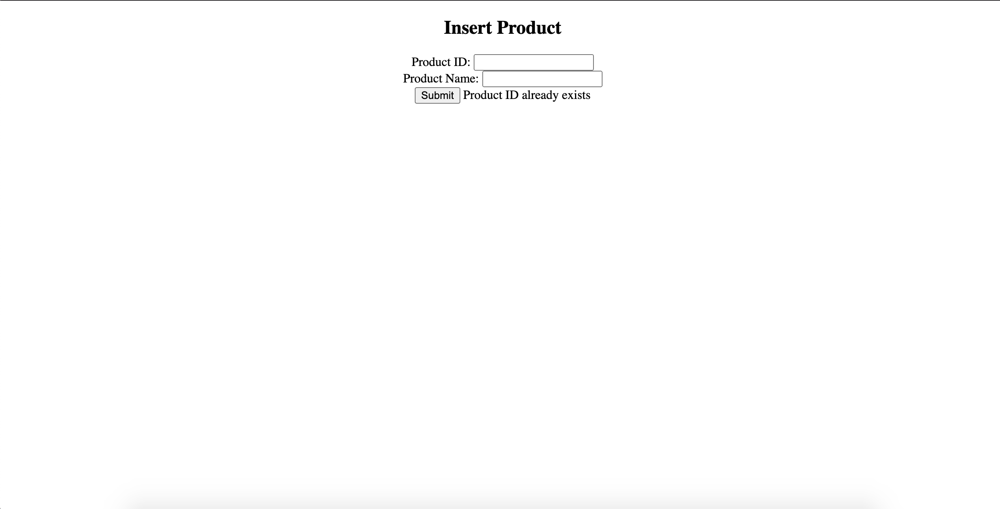

# Adding a New Product in the Database

This program is a servlet-based web application that shows a form to add new products into an H2 database...

## Features

	- Basic product input form
	- Verifies user product input
	- On success inserts product data into database using only hibernate
	- Appropriate error and success messages are outputed upon clicking submission button

## Installation

	- Clone and pull source code from provided github repository
	- Compile source code with Java Compiler
	- Run with Apache Tomcat server

## Code

	https://github.com/nicholas-auyeung/Adding-a-New-Product-in-the-Database

## Flow

1. Start by creating a 'Dynamic Web Project' in Eclipse

2. Import appropriate hibernate and H2 database jar files into library sub directory

3. Create 3 packages, 'com.entity', 'com.servlet', 'com.utility'

4. Create 'Product' class inside 'com.entity' package

5. Create 'productInsert' and 'productValidation' servlets inside 'com.servlet' package

6. Create 'HibernateUtility' class inside 'com.utility'

7. Create hibernate.cfg.xml

8. Configure hibernate.cfg.xml for update, xml mapping, and database connection settings

9. Define 'Product' class

10. Define 'HibernateUtility' class

11. Create 'productform.jsp' jsp page

12. Inside 'productform.jsp' implement working form and set action to 'productValidation'

13. Define 'productValidation' servlet

14. Inside 'productValidation' check for all possible input errors

15. If input errors exist, foward back to 'productform.jsp' with error message

16. If no input errors exist forward input data to 'productInsert' servlet

17. Define 'productInsert' servlet

18. Inside 'productInsert' set up hibernate session and transaction, create product object with user input, save it into session and commit the transaction.

19. If success foward success message to 'productform.jsp'

## Usage

	Once run, the webpage will ask user for product id and name

User inputs incorrect product details (product id only accepts numeric characters)
	
	User will be prompt with 'invalid product id' or 'product id already exists' message 

User inputs correct credentials
	
	User will be prompt with 'product inserted' message

